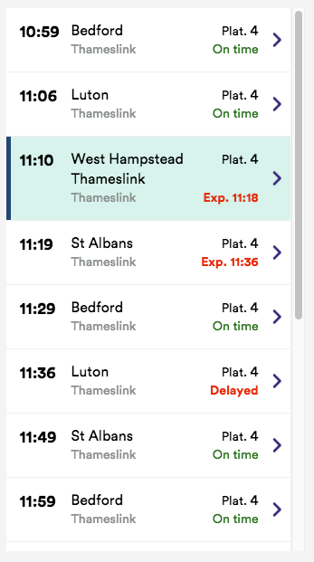
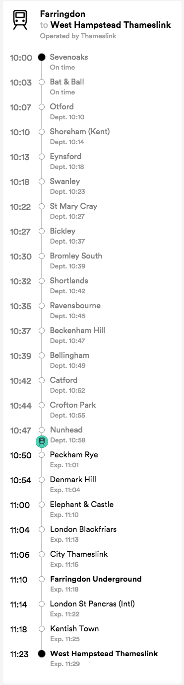

# UI Dev Tech Task

Create a simple two "page" web application using node, react, redux (or another state management library of your choice), to display train services departing from London Waterloo station.

**Basic requirements:**

 - Consume our real-time API, [https://realtime.thetrainline.com/departures/wat](https://realtime.thetrainline.com/departures/wat)
     - CORS and JSONP are not enabled on this end-point, so you will need a proxy or use saved responses
     - The realtime API returns origin/destination stations and service operators as codes, so get your app working by just displaying the codes
     - Include only services where transport mode is TRAIN
 - List all departing services, like this:
 

 - On click/tap on a service, display calling pattern like this:

**Nice to have:**

 - Responsive layout
 - Transition between views
 - Automatic update of train progress